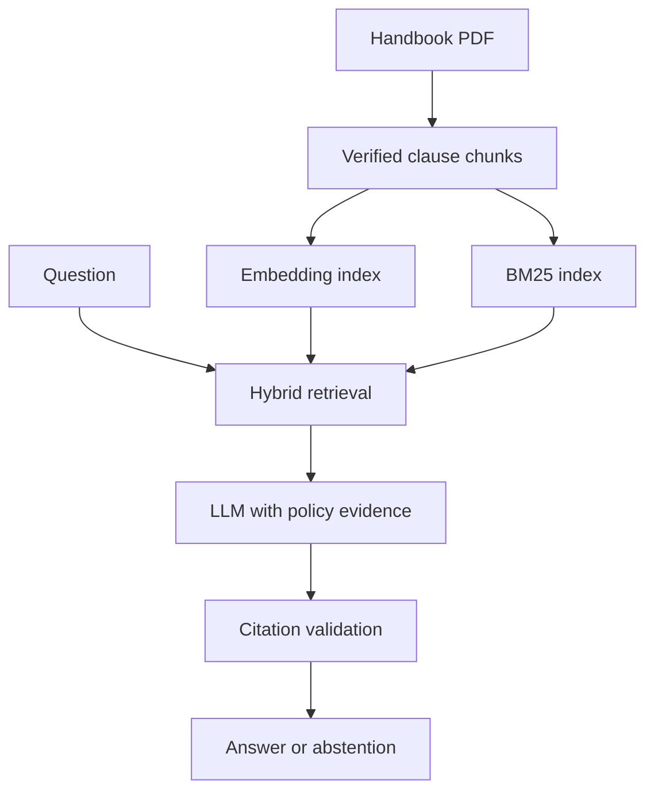

# Product documentation — RAG code update

Persona: employee asking about HR and expense policies; HR/Finance reviewer receiving a manually sent review request.

Input: English question, 1–1,000 characters. Each question is independent. No employee records should be submitted.

Output: in live mode, LLM-written statements with clause IDs and PDF page evidence, missing-information statements, or abstention. Offline mode returns policy excerpts and is labelled no LLM. Neither mode approves transactions.

Build: custom browser UI, parsing, retrieval, prompts, evidence display and validation. Rent: generation and embedding APIs, website hosting. Small corpus uses a local vector array instead of a rented vector database. Model IDs are configurable for generation; embedding model is fixed for compatibility.

| Metric | Target | Status |
|---|---|---|
| Ragas faithfulness | >85% in proposal | Not measured; API configuration pending |
| Context precision | >85% in proposal | Not measured; provided evaluator is reference-free, not a human-reference evaluation |
| User resolution time | <1 minute | No user study; API latency is a different metric |
| Evidence ID integrity | All statements cite supplied chunks | Contract enforced; semantic support still needs evaluation |

No production authentication/RBAC. Public synthetic demonstration only. Session history disappears on refresh. No stored application questions. OpenAI receives questions/evidence in live mode; no verified zero-retention arrangement. Human escalation is a draft, not transmission.
