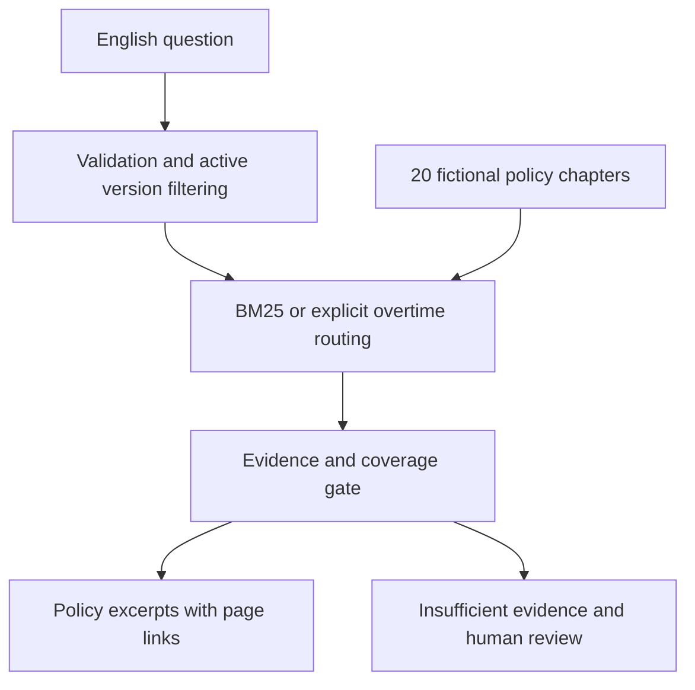

# SmartPolicy product documentation

## Persona and task
An employee checking workplace policies or preparing an expense claim. They need applicable clauses, evidence links and a clear next step when information is missing. HR, Finance and other authorised owners retain approval authority. This is a public demonstration with fictional policies only.

## Input and output
Input: an English question, 1–1,000 characters. No uploads, personal records or employee account access. Each question is independent.
Output: a relevant handbook excerpt with title, version and PDF page; broad overtime questions quote meal and taxi summaries; missing/unsupported information or instruction attacks prompt human review. The interface retains session conversation and supports returning to questions; refreshing clears history.

## Architecture

All question processing runs in the browser. Static hosting supplies assets and policy JSON/PDF. No external LLM, embedding endpoint, vector database, employee authentication or approval tool is called. See README for module responsibilities and run instructions.

## Metrics
| Metric | Target | Reached on reused evaluation labels |
|---|---|---|
| Correct top source among answerable cases | At least 85% | 16/17 = 94.1% |
| Abstention recall | At least 90% | 12/13 = 92.3% |
| Overall source or abstention accuracy | Descriptive | 28/30 = 93.3% |
| Answered source precision | Descriptive | 16/18 = 88.9% |
| Employee task resolution time | Pilot measurement required | Not measured |

These are regression results, not independent confirmation of targets. Corpus changes, shared authorship and inspected labels limit interpretation. No business impact, LLM faithfulness or production security has been demonstrated. Known failures are recorded in evals/README.md.
